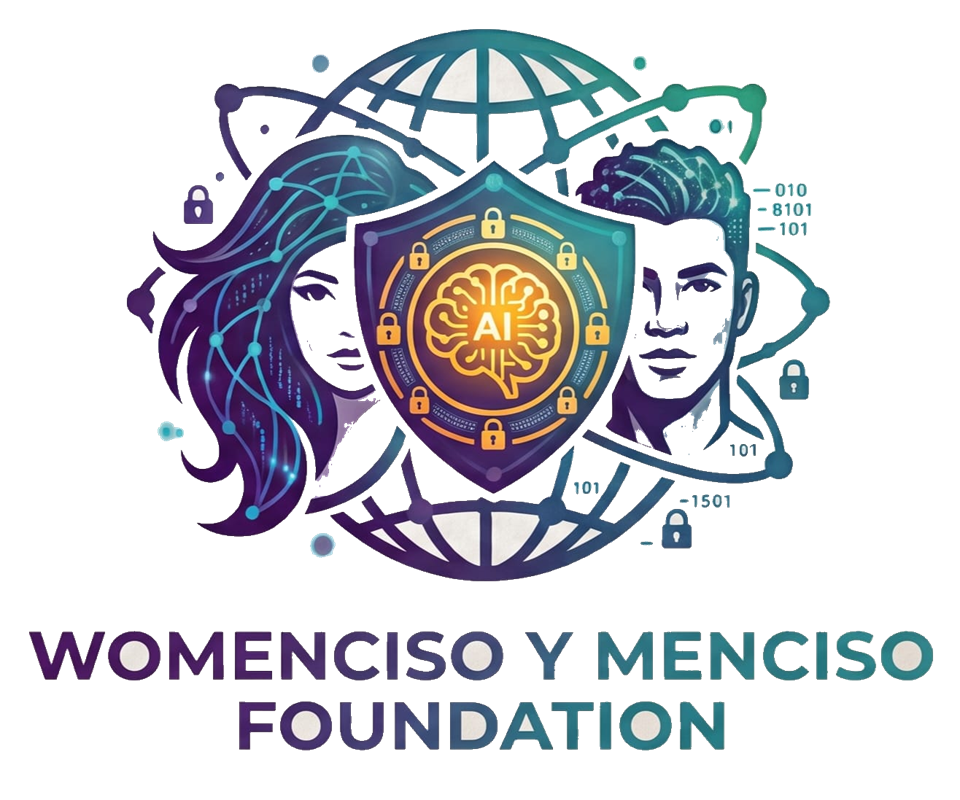

# WomenCiso y MenCiso Foundation — Sistema de Atencion Integral a Quemados

<p align="center">
  
</p>

Sistema web para la atencion de ninos y adolescentes con quemaduras en Mexico. Resuelve tres necesidades criticas: **triage rapido** de emergencias, **canalizacion** a la red hospitalaria correcta segun gravedad, y **seguimiento integral** del paciente (expedientes, psicologia, rehabilitacion, costos).

---

## Problema que resuelve

En Mexico, las quemaduras son la segunda causa de muerte accidental en ninos menores de 5 anos. Cuando ocurre una emergencia:

- Las familias no saben a que hospital acudir segun la gravedad
- Los coordinadores de fundaciones no tienen herramientas digitales para clasificar y canalizar rapidamente
- No existe un sistema unificado que conecte triage, hospitales, seguimiento psicologico y rehabilitacion laboral

Esta plataforma digitaliza todo ese flujo en una sola aplicacion, disenada para funcionar bajo estres y en dispositivos moviles.

---

## Funcionalidades principales

| Modulo | Descripcion |
|--------|-------------|
| **Triage Rapido** | Formulario de 5 pasos con clasificacion automatica de gravedad (CRITICO/GRAVE/MODERADO/LEVE) basada en la regla de la American Burn Association adaptada a pediatria |
| **Red Hospitalaria** | Mapa interactivo con 8 hospitales especializados, camas disponibles en tiempo real, y recomendacion automatica segun ubicacion y gravedad |
| **Sistema de Roles** | 4 tipos de usuario (Admin, Coordinador, Familiar, Hospital) con vistas diferenciadas |
| **OCR de Documentos** | Llenado rapido de formularios a partir de foto de CURP/acta de nacimiento |
| **Expedientes** | Historial completo de atencion por paciente |
| **Psicologia** | Registro de sesiones psicologicas y seguimiento emocional |
| **Rehabilitacion Laboral** | Catalogo de cursos, organizaciones aliadas y bolsa de trabajo |
| **Seguimiento** | Control post-operatorio con proximas citas |
| **Costos** | Registro de gastos medicos y fuentes de financiamiento |
| **Chat de Emergencia** | Comunicacion en tiempo real entre coordinadores y hospitales |
| **Defensa Legal** | Informacion sobre derechos del paciente quemado |
| **Prevencion** | Material educativo para prevencion de quemaduras |
| **Donaciones** | Canal para apoyos economicos a la fundacion |
| **Testimonios** | Historias de pacientes recuperados |

---

## Decisiones de diseno

- **Sin login obligatorio para emergencias**: el boton de Triage Rapido es accesible sin credenciales porque en una emergencia real no hay tiempo para recordar contrasenas.
- **Alto contraste y legibilidad**: fondo blanco con texto oscuro, disenado para situaciones de estres donde la claridad visual es critica.
- **Mobile-first**: toda la interfaz esta optimizada para funcionar en celulares, que es el dispositivo que las familias tienen a mano en una emergencia.
- **Persistencia local del triage**: el progreso del formulario se guarda en el navegador para no perder informacion si la pagina se recarga.

---

## Stack tecnologico

| Tecnologia | Uso |
|-----------|-----|
| **Next.js 16** | Framework principal (App Router, Turbopack) |
| **TypeScript** | Tipado estatico en todo el proyecto |
| **Tailwind CSS 4** | Estilos utilitarios y diseno responsivo |
| **React 19** | Biblioteca de UI |
| **Leaflet + React-Leaflet** | Mapa interactivo de hospitales |
| **Prisma** | ORM y schema de base de datos (PostgreSQL) |
| **Lucide React** | Iconografia |
| **date-fns** | Manejo de fechas |

---

## Uso de Kiro

Este proyecto fue desarrollado integramente con **Kiro** como entorno de desarrollo con IA. Se configuraron:

### Agentes personalizados (`.kiro/agents/`)

| Agente | Funcion |
|--------|---------|
| `descubrimiento` | Cuestiona features antes de construirlas |
| `arquitecto` | Planea logica compleja antes de implementar |
| `disenador` | Audita legibilidad y contraste |
| `revisor-codigo` | Caza bugs que pasan el build pero fallan en uso real |
| `depurador` | Debugging sistematico por causa raiz |
| `seguridad` | Auditoria OWASP/STRIDE para datos de menores |
| `lanzador` | Checklist de verificacion antes de entregar |
| `memoria` | Registro de decisiones en steering |

### Steering (`.kiro/steering/`)

Archivo de contexto persistente que mantiene a Kiro alineado con las decisiones del proyecto: stack, convenciones de codigo, estructura de archivos y reglas de negocio.

---

## Como ejecutar el proyecto

### Prerrequisitos

- Node.js 18+
- npm

### Instalacion

```bash
# Clonar el repositorio
git clone <URL_DEL_REPOSITORIO>
cd "Fundacion WomenCiso y MenCiso"

# Instalar dependencias
npm install

# Ejecutar en modo desarrollo
npm run dev
```

La app estara disponible en `http://localhost:3000`

### Build de produccion

```bash
npm run build
npm run start
```

### Credenciales de demo

| Rol | Usuario | Contrasena |
|-----|---------|------------|
| Administrador | admin | admin |
| Coordinador | coord | coord |
| Familiar/Paciente | familia | familia |
| Hospital | hospital | hospital |

---

## Estructura del proyecto

```
src/
  app/
    (dashboard)/        # Rutas protegidas con sidebar
      costos/           # Registro de gastos medicos
      dashboard/        # Panel principal
      defensa-legal/    # Derechos del paciente
      donaciones/       # Apoyo economico
      emergencias/      # Lista y nueva emergencia (triage)
      expedientes/      # Expedientes medicos
      hospitales/       # Red hospitalaria con mapa
      mi-expediente/    # Vista del paciente/familiar
      pacientes/        # Registro y lista de pacientes
      prevencion/       # Material educativo
      psicologia/       # Sesiones psicologicas
      rehabilitacion/   # Cursos y bolsa de trabajo
      seguimiento/      # Control post-operatorio
      testimonios/      # Historias de recuperacion
    page.tsx            # Pantalla de login
  components/
    banner-demo.tsx     # Banner informativo
    boton-sos.tsx       # Boton de emergencia
    chat-emergencia.tsx # Chat en tiempo real
    lector-voz.tsx      # Lectura por voz (accesibilidad)
    mapa-hospitales.tsx # Mapa interactivo Leaflet
    ocr-documento.tsx   # Extraccion de datos por foto
    qr-expediente.tsx   # QR para acceso rapido a expediente
    layout/             # Sidebar y header
    ui/                 # Componentes base reutilizables
  lib/                  # Utilidades y logica compartida
prisma/
  schema.prisma         # Modelo de datos completo
.kiro/
  agents/               # 9 agentes especializados
  steering/             # Contexto persistente del proyecto
```

---

## Modelo de datos

El schema de Prisma define 10 modelos principales: `Paciente`, `Hospital`, `Emergencia`, `Canalizacion`, `Expediente`, `Cirugia`, `Documento`, `Seguimiento`, `SesionPsicologia`, `Costo` y `Usuario`. Incluye enums para genero, tipo de hospital, nivel de atencion, causa/grado de quemadura, gravedad, prioridad y estados de emergencia/canalizacion.

---

## Accesibilidad

- Focus visible mejorado para navegacion con teclado
- Soporte para `prefers-reduced-motion`
- Soporte para `prefers-contrast: high`
- Atributos ARIA en elementos interactivos
- Textos sr-only para lectores de pantalla
- Inputs con tamano minimo de 16px para evitar zoom en iOS

---

## Equipo

**Desarrollador**: Wladimir Nivia — Ingeniero Informatico

**Fundacion**: WomenCiso y MenCiso Foundation — Organizacion dedicada a la ciberseguridad con enfoque social, aportando respaldo tecnologico y difusion para el despliegue de esta plataforma.

---

## Notas para produccion

- El acceso sin credenciales es aceptable para demo; en produccion se requiere autenticacion real para datos de pacientes menores de edad.
- El OCR es simulado; en produccion se conectaria a una API de vision artificial (GPT-4o Vision, Google Cloud Vision, etc.).
- Los datos mostrados son de ejemplo; no hay base de datos conectada en esta version de demo.
- Los cursos de rehabilitacion y la bolsa de trabajo son ficticios pero basados en organizaciones reales que trabajan con pacientes quemados en Mexico.

---

## Licencia

Proyecto desarrollado para el Hackathon IA Masivo Online AWS por Codigo Facilito (julio 2026). Todos los derechos reservados por el equipo.
